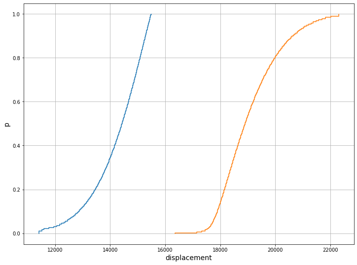
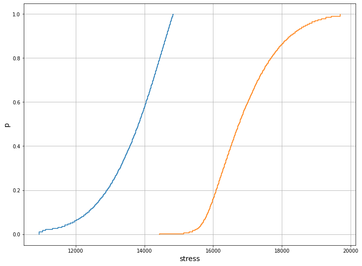

# Probability bounds analysis

High-level algorithms for probability bounds analysis

Cite W&D 

Cite Ferson


## Example: Cantilever beam

```python
unitconversionfactor = 1
def pba(steps=200) :
    y = pbox(normal(0.15, 0.0021))
    L = pbox(interval(9.95,10.05))
    I = pbox(normal(5e-4, 2.6e-5))
    F = pbox(weibull(5.17, 27.5)) 
    E = pbox(normal(200, 3.4), normal(220, 3.4))
    # assuming independence
    Id = unitconversionfactor * Idiv( Imul(F,L^3), Imul(3*E,I))
    Iσ = unitconversionfactor * Idiv( Imul(F, Imul(L,y)), I)
    # Frechet (no assumption about dependence)
    Fd = unitconversionfactor * Fdiv( Fmul(F,L^3), Fmul(3*E,I))
    Fσ = unitconversionfactor * Fdiv( Fmul(F, Fmul(L,y)), I)
    return Id,Iσ,Fd,Fσ
```


### Import the necessary library
#### External libraries

```python
import numpy
import scipy.stats as scipystats
from numpy import mean, std
```

#### Import Frechet
```python
from frechet import pbox, interval, plot
```

### Get handle to continuous distribution object
```python 
normal = scipystats.norm
weibull = scipystats.weibull_min
uniform = scipystats.uniform
```

### Instantiate the p-boxes using the frechet module with 200 steps

```python
steps=200
y  = pbox(*[normal(0.15, 0.0021)]*2,steps=steps)
L3 = pbox(*interval(9.95**3,10.05**3), unbounded=False, interval=True,steps=steps)
L = pbox(*interval(9.95,10.05), unbounded=False, interval=True,steps=steps)
I  = pbox(*[normal(5e-4, 2.6e-5)]*2,steps=steps)
F  = pbox(*[weibull(27.5, loc=0, scale=5.7)]*2,steps=steps) 
E3 = pbox(*[normal(3*200, 3*3.4), normal(3*220, 3*3.4)],steps=steps)
```

### Compute the Frechet bounds with *conversion factor = 1*

```pyhton
Id =  frechet_div( frechet_times(F,L3), frechet_times(E3,I) )
Iσ =  frechet_div( frechet_times( F, frechet_times(L,y) ), I )
```

### Plot the results
```python
plot(Id,xlabel='displacement')
```


```python
plot(Id,xlabel='stress')
```



